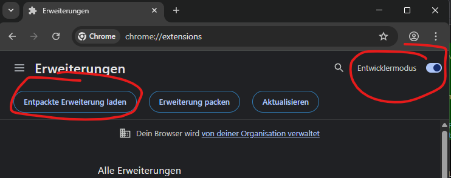

## ONDRA List Select Filter

Annoyed that you have infinitely long lists in OnDRA and cannot easily filter for what you're looking for?

Change that one with this one simple trick. Doctors (and aspiring Dr. ) love this trick!

(click to play video)

## Installation

### Chrome (recommended)

1. Download and unzip this repository
2. Open `chrome://extensions/` in Chrome
3. Enable **Developer mode** (toggle in the top right)
4. Click **Load unpacked** and select the `chrome/` folder

The extension persists across restarts — no signing or admin rights needed.

---

### Firefox

> **Note:** Firefox requires extensions to be signed by Mozilla. The steps below load it as a temporary add-on — it will need to be reloaded after each Firefox restart.

1. Download and unzip this repository
2. Open `about:debugging` in Firefox
3. Click **This Firefox**
4. Click **Load Temporary Add-on...**
5. Select `firefox/manifest.json`
